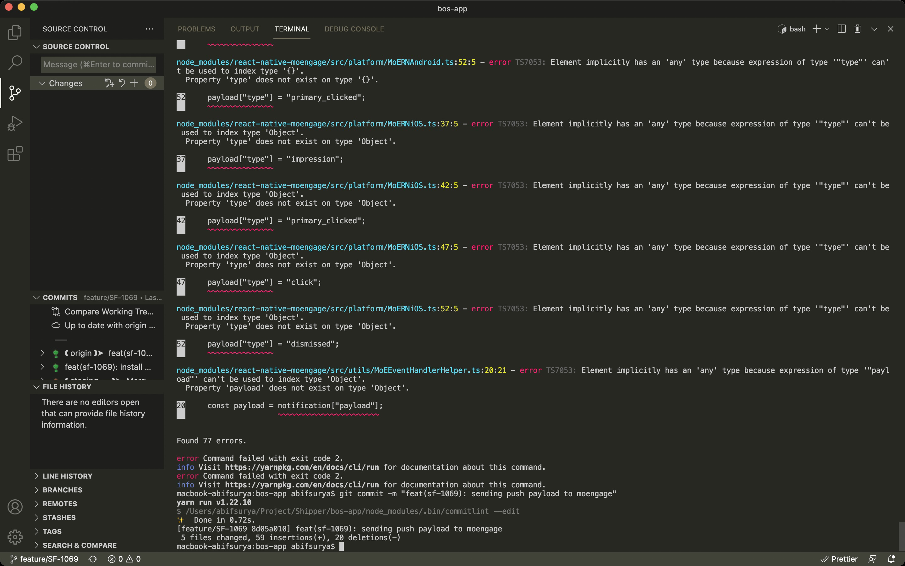

# React Native MoEngage for Typescript
This library copyright from [MoEngage](https://www.moengage.com/), but if you have issues when integrated MoEngage and TypeScript, like this image




this error appears when you run the command `tsc --noEmit`. you can use this library, but if you don't have as this issues, maybe you can follow docs from `react-native-moengage`

## SDK Installation 
Install MoEngage's React Native plugin using the npm package manager. And then link your native dependencies :
```
$ npm install react-native-moengage-custom
```

after you install this package, you can follow docs `MoEngage` and change all `react-native-moengage` to `react-native-moengage-custom`

For more info on how to use react-native-moengage, refer to our developer docs: https://docs.moengage.com/docs/sdk-integration-2
